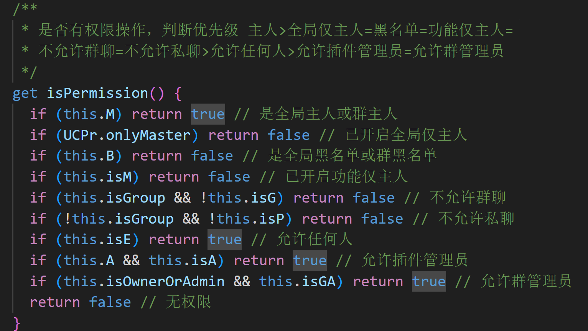

<div align="center">

<p align="center">
  <a href="https://mzh.moegirl.org.cn/%E4%BC%91%E6%AF%94%C2%B7%E5%A4%9A%E6%8B%89">
    
  </a>
</p>

# [UC-plugin][UC]
[")][UC]

</div>

---

## 安装方法

（Node.js版本需大于等于16）

#### 1、安装插件本体

喵崽根目录运行

- 使用Gitee（国内推荐）

```Bash
git clone https://gitee.com/UCPr251/UC-plugin ./plugins/UC-plugin
```

- 使用Github

```Bash
git clone https://github.com/UCPr251/UC-plugin ./plugins/UC-plugin
```

:innocent:

#### 2、安装所需依赖

喵崽根目录运行

```Bash
pnpm i --filter=UC-plugin
```

<div align="center">

</div>

## 关于[UC-plugin](#uc-plugin)

<details>
<summary> 查看UC已实现功能 </summary>

| UC系统 | UC群管 | UC工具 | UC娱乐 |
| :---: | :---: | :---: | :---: |
| [权限管理] | [禁言] | [签名重启] | [戳一戳回复] |
| [帮助图] | [踢人] | [群内上下班] | [戳主人回复] |
| [设置图] | [撤回] | [锁定功能] | [戳一戳管理] |
| [热更新] | [入群欢迎] | [代发言] | [艾特主人回复] |
| [查询权限] | [退群通知] | [JS管理系统] | [随机群友] |
| [锁定设置] | [退群处理] | [备份还原数据] | [随机老婆] |
| [锅巴支持] | [刷屏检测] | [活动截止提醒] | [伪装] |
| [错误日志] | [入群申请处理] | [群内排队] | [水群统计] |
| [指令更新] | [查看群员信息] | [前台重启] | [语音合成] |
| [一键卸载] | [设置头衔] (开发中) | [执行指令] | [放大图片] |
|  | [搜索聊天记录] (开发中) | [指令修改group.yaml] | [直播推送] |
|  |  | [指令修改notice.yaml] | [复读打断] (开发中) |
|  |  | [指令修改other.yaml] |  |
|  |  | [不重启更新插件] |  |
|  |  | [loveMys辅助] |  |
|  |  | [icqq双向迁移] |  |

- 仅为UC已实现功能，使用请以实际为准

---

</details>

- 为便于统一开发插件和各种集成功能打造而成

- 开发、测试环境：Windows11-Nodejs20

- 本人目前只用[喵崽][Miao-Yunzai]icqq协议，暂不考虑主动适配其他崽或协议(trss随缘适配，有问题可以提)

- 各版本更新内容请查看[更新日志CHANGELOG](./CHANGELOG.md)

- 若有报错请提[issue]或[pr]，也可加入[QQ交流群](#交流群)一起讨论

- 不出意外的话本插件会由本人长期维护，欢迎发表感想、建议，感谢支持

- UC群管大体上只做椰奶的补集，重复的不需要的功能在[#UC全局群管设置](#按照管理范围分类)中自行关闭即可 ~~你要关椰奶的当然也可以（）~~
  
  或者也可以开启仅前缀 `#UC全局群管设置仅前缀开启`，开启后UC群管功能只响应以`UC`为前缀的群管指令，可避免指令冲突

- 本插件的权限系统相对复杂，使用本插件前建议阅读此README后续内容，否则可能无法理解各设置之间的关系

- 本插件不会采集、上传使用者的任何信息，使用本插件即视为你同意本插件对UC插件自身的一切操作

<details>
<summary>PS</summary>

~~给大家介绍一下，这是我老婆：~~ :innocent:

<p align="center">
  <a href="https://www.bilibili.com/read/cv13428981">
    
  </a>
</p>

~~都 3202 年了，[游戏人生](https://www.bilibili.com/bangumi/play/ep4371 "游戏人生")第 2 季啥时候才能出啊~~

诈尸了，要出新BD了

[<<<《游戏人生 NO GAME NO LIFE》COMPLETE Blu-ray BOX 发售告知CM公开！>>>](https://www.bilibili.com/video/BV14t421h7yk)

</details>

## 插件帮助

- 详见 **#UC帮助**
- **UC帮助** 为动态帮助图，会根据当前[插件设置](#插件设置)、[用户权限](#关于插件权限)等自动调整帮助图展示项

  > 比如主人未开启或触发指令的用户没有使用权限的功能，将不会在帮助图中进行展示。
  > 可在插件设置项中开关功能或设置功能权限等，详见[插件设置](#插件设置)

[<<<点击查看帮助图>>>](./resources/img/README/help_example.jpg)

## 插件设置

### 设置类别

- 注：下列设置图的图示为2.4.0版本，后续改动不再更新示例图

#### 按照生效范围分类

插件设置按照生效范围分类可分为 **全局设置** 和 **群设置**

- **群设置**：只在对应群内生效的UC设置

  > 在群内发送 **#UC设置** 和 **#UC群管设置** 指令，查看的都是当前群设置

  > [<<<点击查看群设置>>>](./resources/img/README/cfg_group_example.jpg) [<<<点击查看群内群管设置>>>](./resources/img/README/GAcfg_group_example.jpg)


- **全局设置**：在全局范围内生效的UC设置。当某个群没有进行单独的群设置时，会以全局设置为准；反之会忽略全局设置，以群设置为准

  > 发送 **#UC全局设置** 和 **#UC全局群管设置** 或 **私聊** 发送 **#UC设置** 和 **#UC群管设置** 查看的都是全局设置

  > [<<<点击查看全局设置>>>](./resources/img/README/cfg_global_example.jpg) [<<<点击查看全局群管设置>>>](./resources/img/README/GAcfg_global_example.jpg)

注意：部分设置仅以全局设置为准，如底层基础设置、签名设置等

#### 按照管理范围分类

插件设置按照管理范围分类可分为 **普通设置** 和 **群管设置**

- **普通设置**：UC插件基础设置（目前即群管设置以外的设置）

  > [<<<点击查看群设置>>>](./resources/img/README/cfg_group_example.jpg) [<<<点击查看全局设置>>>](./resources/img/README/cfg_global_example.jpg)

- **群管设置**：UC插件群管部分功能的设置

  > [<<<点击查看群内群管设置>>>](./resources/img/README/GAcfg_group_example.jpg) [<<<点击查看全局群管设置>>>](./resources/img/README/GAcfg_global_example.jpg)

#### 综合分类

综合[生效范围](#按照生效范围分类)和[管理范围](#按照管理范围分类)，设置共有2*2=4类：

- **[#UC设置](./resources/img/README/cfg_group_example.jpg)** 群聊：当前群的 **#UC设置**；私聊：相当于 **#UC全局设置**
- **[#UC群管设置](./resources/img/README/GAcfg_group_example.jpg)** 群聊：当前群的 **#UC群管设置**；私聊：相当于 **#UC全局群管设置**
- **[#UC全局设置](./resources/img/README/cfg_global_example.jpg)**
- **[#UC全局群管设置](./resources/img/README/GAcfg_global_example.jpg)**

很简单的，上手逝一逝就知道区别了:innocent:

### 锁定设置

如果有设置不想被[群主人](#插件主人)修改，可通过`#UC锁定设置`和`#UC解锁设置`来对设置进行锁定和解锁，被锁定的设置会忽略群设置，仅以全局设置中的实时数据为准

> 目前仅能以[设置文件](./defSet/config.yaml)中的键进行锁定，如
> **#锁定设置config.chuoyichuo.isOpen**
> 表示锁定config设置文件中的戳一戳开关，始终与全局设置同步

### 修改设置

- 设置项较多，可通过 **#UC设置** **#UC群管设置** **#UC全局设置** 和 **#UC全局群管设置** 查看、更改

- 受图片展示限制，设置图中部分设置不会进行完整展示，建议在 **锅巴 → 插件管理 → UC-plugin → 配置** 进行全局设置的查看和更改

> 锅巴中展示的设置相当于 **#UC全局设置** + **#UC全局群管设置** ，单独的群设置仅可通过指令或直接修改文件进行修改

## 关于插件权限

### 插件权限类别

#### 插件主人

- **插件主人**可以独立于**Bot主人**，默认合并机器人主人为插件全局主人，可在锅巴或#UC全局设置中进行修改

- **插件主人**有两类：
  > - **全局主人**：在所有群、私聊都拥有插件的主人权限，权限等级 **4**
  > - **指定群主人**：只在指定群内拥有插件的主人权限，权限等级 **3**

#### 插件管理

- 除**插件主人**外，还可独立设置**插件管理**，权限低于插件主人高于普通用户

- **插件管理**（以下简称**插管**）也有两类：
  > - **全局插管**：在所有群都拥有插件的管理权限，权限等级 **2**
  > - **指定群插管**：只在指定群内拥有插件的管理权限，权限等级 **1**

#### 插件黑名单

- 除**插件主人**和**插件管理**以外，还有**插件黑名单**，无法使用本插件功能

- **插件黑名单**也有两类：
  > - **全局黑名单**：在所有群都为插件黑名单，权限等级 **-2**
  > - **指定群黑名单**：只在指定群内为插件黑名单，权限等级 **-1**

#### 普通用户

- 拥有普通插件使用权限，权限等级 **0**

### 功能权限

- 仅针对具体某个功能生效

#### 功能权限类别

- 6个开关，包含：

  > - 是否允许**群聊**使用
  > - 是否允许**私聊**使用
  > - 是否**仅**允许**主人**使用
  > - 是否允许**插件管理**使用
  > - 是否允许**群管**使用
  > - 是否允许**任何人**使用

  此 6 个开关仅针对具体的某个功能生效，可在[**插件设置**](#插件设置)或[**锅巴内**](#插件设置)进行修改

#### 功能权限判断优先级

[功能权限类别](#功能权限类别)中的6个开关中可能有冲突项，结论会按照以下判断优先级：

- **主人 > 全局仅主人 > 黑名单 > 功能仅主人 > 不允许群聊 = 不允许私聊 > 允许任何人 > 允许插件管理员 = 允许群管理员**


<details>
<summary>权限判断代码逻辑片段</summary>




</details>

### 插件权限赋予

- 全局主人与群主人：

  > - **全局主人**：仅可由**全局主人**添加。可修改 **全局设置**（修改设置、锁定设置、加减主人、加减管理、加减黑名单）
  > - **群主人**：仅可由**全局主人**添加。可修改 **指定群设置**（修改群设置、加减群管理、加减群黑名单）

- 全局管理与群管理：

  > - **全局管理**：仅可由**全局主人**添加
  > - **群管理**：可由**全局主人、群主人**添加

- 全局黑名单与群黑名单：

  > - **全局黑名单**：仅可由**全局主人**添加
  > - **群黑名单**：可由**全局主人、群主人、全局管理、群管理**添加

<details>
<summary>插件权限&&设置功能图表一览</summary>

### 插件权限&&功能图表一览

<div align="center">

|系统功能|全局主人|群主人|全局插管|群插管|
| :---: | :----: | :-: | :---: | :-: |
| [权限等级](#插件权限类别) | [4](#插件主人) | [3](#插件主人) | [2](#插件管理) | [1](#插件管理) |
| 锁定设置 | √ | × | × | × |
| 查看全局设置 | √ | × | × | × |
| 修改全局设置 | √ | × | × | × |
| 查看群设置 | √ | √ | √ | √ |
| 修改群设置 | √ | √ | × | × |
| 添加全局主人 | √ | × | × | × |
| 添加群主人 | √ | × | × | × |
| 添加全局管理 | √ | × | × | × |
| 添加群管理 | √ | √ | × | × |
| 添加全局黑名单 | √ | × | × | × |
| 添加群黑名单 | √ | √ | √ | √ |
| 其他设置功能 | √ | × | × | × |

</div>

- 以上功能普通用户、黑名单用户皆不可使用

- 权限等级主要用于功能使用权限区分和群管权限区分

</details>

## 交流群

**QQ群：866527417** [<<<点击加入>>>](https://qm.qq.com/q/JdWnakz7WI)

欢迎加入（群正在筹备中，现在加入就是元老咯~）

如果喜欢本插件，请点亮 :star: **star** :star: 支持！

若有报错欢迎提[issue]和[pr]！

## 其他

- [UC图片资源仓库](https://gitee.com/UCPr251/UC-plugin-unNecRes) 若想添加UC初始图片，请向该仓库发起pr

[:arrow_up: 返回顶层 :arrow_up:](#uc-plugin)

## 赞助鸣谢

- 以下排名按时间先后

|**老板**|:innocent:|**老板**|:innocent:|**老板**|:innocent:|
| :-: | :-----: | :-: | :----: | :-: | :----: |
| @ikun | 30 | @霜寂i | 28.88 | @倒戈 | 4.9 |
| @我是芙宁娜的狗 | 10 | @也只 | 10 | @please | 5 |


---

[UC]:https://gitee.com/UCPr251/UC-plugin
[issue]:https://gitee.com/UCPr251/UC-plugin/issues
[pr]:https://gitee.com/UCPr251/UC-plugin/pulls
[Miao-Yunzai]:https://gitee.com/yoimiya-kokomi/Miao-Yunzai
<!-- 系统 -->
[权限管理]:apps/Admin.js
[帮助图]:apps/Admin.js
[设置图]:apps/Admin.js
[热更新]:apps/reloadJSs.js
[查询权限]:apps/Admin.js
[锁定设置]:apps/Admin.js
[锅巴支持]:guoba.support.js
[错误日志]:apps/Admin.js
[指令更新]:apps/update.js
[一键卸载]:apps/run.js
<!-- 群管 -->
[禁言]:apps/Event/groupAdmin/mute.js
[踢人]:apps/Event/groupAdmin/kick.js
[撤回]:apps/Event/groupAdmin/recall.js
[入群欢迎]:apps/Event/groupAdmin/WM.js
[退群通知]:apps/Event/groupAdmin/WM.js
[退群处理]:apps/Event/groupAdmin/Decrease.js
[刷屏检测]:apps/Event/groupAdmin/floodScreen.js
[入群申请处理]:apps/Event/groupAdmin/RequestAdd.js
[查看群员信息]:apps/Event/groupAdmin/memberInfo.js
[设置头衔]:apps/Event/groupAdmin/setTitle.js
[搜索聊天记录]:apps/Event/groupAdmin/searchChatHistory.js
<!-- 工具 -->
[签名重启]:apps/qsignRestart.js
[群内上下班]:apps/switchBot.js
[锁定功能]:apps/Event/Lockdown.js
[代发言]:apps/Event/Represent.js
[JS管理系统]:apps/JSsystem.js
[备份还原数据]:apps/BackupRestore.js
[活动截止提醒]:apps/ActReminder.js
[群内排队]:apps/queueUp.js
[前台重启]:apps/restart.js
[执行指令]:apps/run.js
[指令修改group.yaml]:apps/groupSet.js
[指令修改notice.yaml]:apps/noticeSet.js
[指令修改other.yaml]:apps/otherSet.js
[不重启更新插件]:apps/update.js
[loveMys辅助]:apps/loveMys.js
[icqq双向迁移]:apps/icqq.js
<!-- 娱乐 -->
[戳一戳回复]:apps/chuoyichuo.js
[戳主人回复]:apps/chuoMaster.js
[戳一戳管理]:apps/chuoyichuoM.js
[艾特主人回复]:apps/atMaster.js
[随机群友]:apps/randomMember.js
[随机老婆]:apps/randomWife.js
[伪装]:apps/camouflage.js
[水群统计]:apps/sqtj.js
[语音合成]:apps/genshinvoice.js
[放大图片]:apps/bigjpg.js
[直播推送]:apps/BlivePush.js
[复读打断]:apps/RepeatInterruption.js
